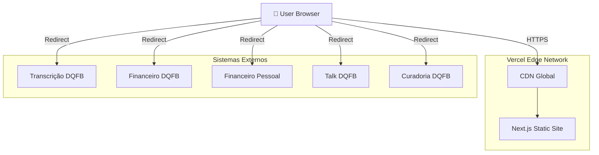
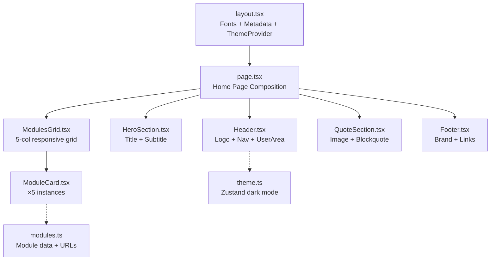

# DQFB Business — Architecture Document

## Introduction

Este documento define a arquitetura técnica do portal DQFB Business, um hub centralizado para 5 sistemas de negócio existentes. O portal é uma aplicação frontend-only (sem backend, sem banco de dados, sem autenticação no MVP) implementada com Next.js e Tailwind CSS, seguindo o design system "The Velvet Editorial".

**Starter Template:** N/A — Greenfield project usando preset `nextjs-react`.

### Change Log

| Date | Version | Description | Author |
|------|---------|-------------|--------|
| 2026-04-08 | 0.1 | Criação inicial da arquitetura | Aria (Architect) |

---

## High Level Architecture

### Technical Summary

O DQFB Business é uma aplicação Next.js 16+ (App Router) deployada na Vercel como site estático (SSG). Não possui backend próprio — funciona como portal de navegação para 5 sistemas externos via links configuráveis. O frontend é construído com React + TypeScript + Tailwind CSS, utilizando tokens de cor customizados do design system "The Velvet Editorial". A aplicação é uma single-page com componentes reutilizáveis, otimizada para performance (< 2s load time) com fonts auto-hospedadas e assets otimizados.

### Platform and Infrastructure

**Platform:** Vercel
**Key Services:** Vercel Edge Network (CDN), Vercel Analytics (opcional)
**Deployment:** Região auto (edge global)

**Rationale:** Vercel é a plataforma natural para Next.js — zero-config deploy, CDN global, preview deploys automáticos. Como o portal é estático, não há custo de serverless functions.

### Repository Structure

**Structure:** Single App (não monorepo)
**Rationale:** O portal é uma única aplicação Next.js sem packages compartilhados ou múltiplos apps. Monorepo seria over-engineering para este escopo.

### High Level Architecture Diagram



### Architectural Patterns

- **Static Site Generation (SSG):** Toda a página é gerada em build time, servida via CDN — _Rationale:_ Sem dados dinâmicos, máxima performance e cache
- **Component-Based UI:** Componentes React isolados com TypeScript — _Rationale:_ Reutilização, testabilidade, manutenção do design system
- **Token-Based Design System:** Tailwind tokens mapeiam 1:1 com o design system — _Rationale:_ Consistência visual, fácil manutenção de temas (light/dark)
- **Configuration-Driven Navigation:** URLs dos módulos via env vars — _Rationale:_ Flexibilidade para mudar URLs sem rebuild

---

## Tech Stack

| Category | Technology | Version | Purpose | Rationale |
|----------|-----------|---------|---------|-----------|
| Language | TypeScript | 5.x | Type-safe development | Preset padrão, previne bugs |
| Framework | Next.js | 16+ | App Router, SSG | Preset ativo, deploy Vercel nativo |
| UI Library | React | 19+ | Componentes | Incluído com Next.js |
| CSS Framework | Tailwind CSS | 4.x | Styling com tokens | Protótipo já em Tailwind |
| Fonts | Google Fonts | — | Fraunces, Manrope, Noto Serif | Definido no design system |
| Icons | Material Symbols | — | Outlined icons | Já usado no protótipo |
| State | Zustand | 5.x | Dark mode toggle | Leve, simples para estado global |
| Testing | Vitest | 3.x | Unit tests | Rápido, compatível com Vite/Next |
| E2E Testing | Playwright | 1.x | Visual regression | Valida responsividade e dark mode |
| Linting | ESLint + Prettier | — | Code quality | Padrão Next.js |
| Deploy | Vercel | — | Hosting + CDN | Zero-config para Next.js |
| CI/CD | GitHub Actions | — | Build + deploy | Integração com Vercel |

---

## Components

### Component Architecture

```
src/
├── app/
│   ├── layout.tsx              # Root layout (fonts, metadata, dark mode provider)
│   ├── page.tsx                # Home page (compõe todos os componentes)
│   └── globals.css             # Tailwind directives + custom utilities
├── components/
│   ├── layout/
│   │   ├── Header.tsx          # Top nav: logo, links, user area
│   │   └── Footer.tsx          # Footer: brand, links, copyright
│   ├── sections/
│   │   ├── HeroSection.tsx     # Hero editorial: título + subtítulo
│   │   ├── ModulesGrid.tsx     # Grid container dos 5 cards
│   │   └── QuoteSection.tsx    # Citação editorial + imagem
│   ├── cards/
│   │   └── ModuleCard.tsx      # Card de módulo (reutilizável, props-driven)
│   └── ui/
│       ├── DarkModeToggle.tsx  # Toggle dark mode
│       └── Icon.tsx            # Wrapper Material Symbols
├── config/
│   └── modules.ts              # Configuração dos 5 módulos (dados + URLs)
├── stores/
│   └── theme.ts                # Zustand store para dark mode
├── types/
│   └── module.ts               # TypeScript types (Module, ModuleConfig)
└── lib/
    └── fonts.ts                # Next.js font configuration
```

### Component Specifications

#### ModuleCard (componente principal)

```typescript
// src/types/module.ts
export interface ModuleConfig {
  id: string;
  title: string;
  subtitle: string;         // "DQFB" ou "Pessoal"
  label: string;            // "Módulo Alpha", "Módulo Corporate", etc.
  description: string;
  icon: string;             // Material Symbols icon name
  iconFilled?: boolean;     // font-variation-settings FILL 1
  bgColor: string;          // Tailwind class ou hex
  buttonText: string;       // "Acessar Sistema", "Visualizar Fluxo", etc.
  url: string;              // URL do sistema externo
}
```

```typescript
// src/config/modules.ts
export const modules: ModuleConfig[] = [
  {
    id: 'transcricao',
    title: 'Transcrição',
    subtitle: 'DQFB',
    label: 'Módulo Alpha',
    description: 'Transforme áudio em ativos intelectuais com precisão cirúrgica e contexto editorial refinado.',
    icon: 'record_voice_over',
    bgColor: 'bg-primary',
    buttonText: 'Acessar Sistema',
    url: process.env.NEXT_PUBLIC_MODULE_TRANSCRICAO_URL ?? '#',
  },
  {
    id: 'financeiro',
    title: 'Financeiro',
    subtitle: 'DQFB',
    label: 'Módulo Corporate',
    description: 'Gestão de tesouraria e fluxo de caixa com dashboards inteligentes para tomada de decisão executiva.',
    icon: 'payments',
    bgColor: 'bg-secondary',
    buttonText: 'Visualizar Fluxo',
    url: process.env.NEXT_PUBLIC_MODULE_FINANCEIRO_URL ?? '#',
  },
  {
    id: 'financeiro-pessoal',
    title: 'Financeiro',
    subtitle: 'Pessoal',
    label: 'Módulo Personal',
    description: 'Planejamento patrimonial e controle de ativos individuais com a segurança DQFB Business.',
    icon: 'account_balance_wallet',
    iconFilled: true,
    bgColor: 'bg-tertiary-container',
    buttonText: 'Gerenciar',
    url: process.env.NEXT_PUBLIC_MODULE_FINANCEIRO_PESSOAL_URL ?? '#',
  },
  {
    id: 'talk',
    title: 'Talk',
    subtitle: 'DQFB',
    label: 'Módulo Connect',
    description: 'Comunicação direta e segura. Reuniões, chats e compartilhamento de arquivos em ambiente criptografado.',
    icon: 'forum',
    bgColor: 'bg-[#680114]',
    buttonText: 'Entrar na Sala',
    url: process.env.NEXT_PUBLIC_MODULE_TALK_URL ?? '#',
  },
  {
    id: 'curadoria',
    title: 'Curadoria',
    subtitle: 'DQFB',
    label: 'Módulo Insight',
    description: 'Conteúdo selecionado e análise macroeconômica diária preparada pelo nosso team editorial.',
    icon: 'auto_awesome',
    iconFilled: true,
    bgColor: 'bg-[#0C453E]',
    buttonText: 'Ver Insights',
    url: process.env.NEXT_PUBLIC_MODULE_CURADORIA_URL ?? '#',
  },
];
```

#### Component Diagram



---

## Frontend Architecture

### Tailwind Configuration

```typescript
// tailwind.config.ts
import type { Config } from 'tailwindcss';

const config: Config = {
  darkMode: 'class',
  content: ['./src/**/*.{ts,tsx}'],
  theme: {
    extend: {
      colors: {
        // Primary (Velvet)
        'primary': '#680114',
        'primary-container': '#881d28',
        'on-primary': '#ffffff',
        'on-primary-container': '#ff999a',
        
        // Secondary (Precious)
        'secondary': '#34675f',
        'secondary-container': '#b5eae0',
        'on-secondary': '#ffffff',
        'on-secondary-container': '#396b63',
        
        // Tertiary (Pinky)
        'tertiary': '#63003b',
        'tertiary-container': '#8c0055',
        'on-tertiary': '#ffffff',
        'on-tertiary-container': '#ff94c1',
        
        // Surfaces
        'surface': '#fcf8f7',
        'surface-dim': '#ddd9d8',
        'surface-container-lowest': '#ffffff',
        'surface-container-low': '#f7f3f2',
        'surface-container': '#f1edec',
        'surface-container-high': '#ebe7e6',
        'surface-container-highest': '#e5e2e1',
        'surface-variant': '#e5e2e1',
        
        // On-surface
        'on-surface': '#1c1b1b',
        'on-surface-variant': '#574141',
        
        // Outline
        'outline': '#8b7170',
        'outline-variant': '#debfbe',
        
        // Inverse
        'inverse-surface': '#313030',
        'inverse-on-surface': '#f4f0ef',
        'inverse-primary': '#ffb3b2',
        
        // Error
        'error': '#ba1a1a',
        'error-container': '#ffdad6',
        'on-error': '#ffffff',
        'on-error-container': '#93000a',
        
        // Background
        'background': '#fcf8f7',
        'on-background': '#1c1b1b',
      },
      borderRadius: {
        DEFAULT: '0.125rem',
        'lg': '0.25rem',
        'xl': '0.5rem',
        'full': '0.75rem',
      },
      fontFamily: {
        display: ['var(--font-fraunces)', 'serif'],
        body: ['var(--font-manrope)', 'sans-serif'],
        serif: ['var(--font-noto-serif)', 'serif'],
      },
    },
  },
  plugins: [],
};

export default config;
```

### Font Configuration

```typescript
// src/lib/fonts.ts
import { Fraunces, Manrope, Noto_Serif } from 'next/font/google';

export const fraunces = Fraunces({
  subsets: ['latin'],
  variable: '--font-fraunces',
  display: 'swap',
});

export const manrope = Manrope({
  subsets: ['latin'],
  variable: '--font-manrope',
  display: 'swap',
});

export const notoSerif = Noto_Serif({
  subsets: ['latin'],
  variable: '--font-noto-serif',
  display: 'swap',
});
```

### State Management

```typescript
// src/stores/theme.ts
import { create } from 'zustand';

interface ThemeStore {
  isDark: boolean;
  toggle: () => void;
}

export const useThemeStore = create<ThemeStore>((set) => ({
  isDark: false,
  toggle: () => set((state) => ({ isDark: !state.isDark })),
}));
```

### Routing Architecture

```
app/
├── layout.tsx          # Root: fonts, metadata, theme class
├── page.tsx            # Home (única rota)
├── not-found.tsx       # 404 custom
└── globals.css         # Tailwind base + utilities
```

Single-page — sem rotas adicionais no MVP. O App Router do Next.js gerencia o layout e metadata.

---

## Unified Project Structure

```
dqfb-business/
├── .github/
│   └── workflows/
│       └── deploy.yml              # Vercel deploy via GitHub Actions
├── docs/
│   ├── prd.md                      # Product Requirements Document
│   └── architecture.md             # Este documento
├── telas/
│   ├── DESIGN.md                   # Design System reference
│   ├── code.html                   # HTML prototype reference
│   └── screen.png                  # Screenshot reference
├── src/
│   ├── app/
│   │   ├── layout.tsx              # Root layout
│   │   ├── page.tsx                # Home page
│   │   ├── not-found.tsx           # 404
│   │   └── globals.css             # Global styles
│   ├── components/
│   │   ├── layout/
│   │   │   ├── Header.tsx
│   │   │   └── Footer.tsx
│   │   ├── sections/
│   │   │   ├── HeroSection.tsx
│   │   │   ├── ModulesGrid.tsx
│   │   │   └── QuoteSection.tsx
│   │   ├── cards/
│   │   │   └── ModuleCard.tsx
│   │   └── ui/
│   │       ├── DarkModeToggle.tsx
│   │       └── Icon.tsx
│   ├── config/
│   │   └── modules.ts              # Module definitions + URLs
│   ├── stores/
│   │   └── theme.ts                # Dark mode state
│   ├── types/
│   │   └── module.ts               # TypeScript interfaces
│   └── lib/
│       └── fonts.ts                # Font configuration
├── tests/
│   ├── components/
│   │   ├── ModuleCard.test.tsx
│   │   ├── Header.test.tsx
│   │   └── HeroSection.test.tsx
│   └── e2e/
│       └── portal.spec.ts          # Playwright E2E
├── public/
│   └── images/                     # Static images (quote section)
├── .env.example                    # Environment template
├── .env.local                      # Local env (gitignored)
├── .gitignore
├── next.config.ts
├── tailwind.config.ts
├── tsconfig.json
├── vitest.config.ts
├── package.json
└── README.md
```

---

## Development Workflow

### Prerequisites

```bash
node --version  # v20+
npm --version   # 10+
```

### Initial Setup

```bash
npx create-next-app@latest . --typescript --tailwind --eslint --app --src-dir
npm install zustand
npm install -D vitest @testing-library/react @testing-library/jest-dom @vitejs/plugin-react jsdom playwright
```

### Development Commands

```bash
# Start dev server
npm run dev

# Build for production
npm run build

# Run unit tests
npm run test

# Run E2E tests
npx playwright test

# Lint
npm run lint

# Type check
npx tsc --noEmit
```

### Environment Variables

```bash
# .env.example
NEXT_PUBLIC_MODULE_TRANSCRICAO_URL=https://transcricao.dqfb.com
NEXT_PUBLIC_MODULE_FINANCEIRO_URL=https://financeiro.dqfb.com
NEXT_PUBLIC_MODULE_FINANCEIRO_PESSOAL_URL=https://pessoal.dqfb.com
NEXT_PUBLIC_MODULE_TALK_URL=https://talk.dqfb.com
NEXT_PUBLIC_MODULE_CURADORIA_URL=https://curadoria.dqfb.com
```

---

## Deployment Architecture

### Strategy

**Platform:** Vercel
**Build:** `next build` (SSG output)
**CDN:** Vercel Edge Network (global)
**Preview:** Automático por branch/PR

### Environments

| Environment | URL | Purpose |
|-------------|-----|---------|
| Development | localhost:3000 | Local development |
| Preview | *.vercel.app | PR previews |
| Production | dqfb.business (ou custom domain) | Live |

### CI/CD Pipeline

```yaml
# .github/workflows/deploy.yml
name: Deploy
on:
  push:
    branches: [main]
  pull_request:

jobs:
  quality:
    runs-on: ubuntu-latest
    steps:
      - uses: actions/checkout@v4
      - uses: actions/setup-node@v4
        with:
          node-version: 20
          cache: npm
      - run: npm ci
      - run: npm run lint
      - run: npx tsc --noEmit
      - run: npm test
      - run: npm run build
```

Vercel auto-deploys na integração com GitHub — o workflow valida qualidade antes do merge.

---

## Security and Performance

### Performance

- **SSG:** Páginas pré-renderizadas, servidas via CDN (TTFB < 100ms)
- **Font Loading:** `next/font` com `display: swap` — sem FOUT, fonts auto-hospedadas
- **Images:** `next/image` com lazy loading e otimização automática
- **CSS:** Tailwind purge em build — apenas classes usadas no bundle final
- **Target:** Lighthouse >= 90 em todas as métricas

### Security

- **CSP Headers:** Configurados via `next.config.ts` (restrict scripts, fonts, images)
- **HTTPS:** Enforced pela Vercel
- **Env Vars:** URLs dos módulos via `NEXT_PUBLIC_*` (public, não sensível)
- **No User Data:** Portal não coleta, armazena ou processa dados de usuário no MVP

---

## Design System Implementation Rules

Extraído de `telas/DESIGN.md` — regras que o @dev DEVE seguir:

1. **No-Line Rule:** Nunca usar `border-1px-solid`. Separação por cor de fundo
2. **Surface Hierarchy:** Usar tokens `surface-container-*` para profundidade
3. **Glass & Gradient:** Nav flutuante com `backdrop-blur-[16px]` + surface semi-transparente
4. **Signature Textures:** CTAs com gradient `primary` → `primary-container` a 135°
5. **Typography Mix:** Misturar regular + italic em headlines (Fraunces)
6. **Asymmetric Layout:** Margens amplas, evitar centralização perfeita
7. **Shadow Tinting:** Sombras tintadas com `on-surface` a 4-8% opacity, blur 30-60px
8. **Ghost Border:** Se border necessário, usar `outline-variant` a 15% opacity
9. **Sharp Corners:** `rounded-sm` (0.125rem) default para cards/buttons — sem rounded-lg
10. **Space Over Lines:** Separar itens de lista com spacing (24px gap), não dividers

---

*Generated by AIOX — Aria (Architect) | 2026-04-08*
